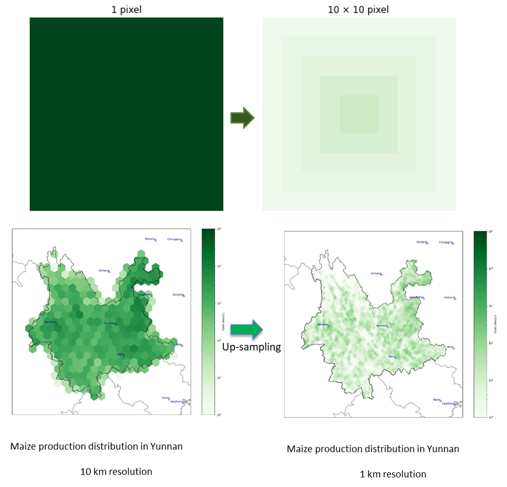

# SPAM-China-1km

## Overview
This script generates the distribution of crop production at the provincial level in China from 2010 to 2022. It currently covers 17 types of crops, with plans to expand in the future. The script provides detailed information on crop production distribution based on various irrigation technologies.

## Key Features
- **Historical Data Analysis:** Covers crop distribution data from 2010 to 2022.
- **Multiple Crop Types:** Supports 17 different crop types, with plans to add more.
- **Irrigation Technology Impact:** Analyzes crop production based on different irrigation technologies.

## Methodology

we combine SPAM with production values from the National Bureau of Statistics to generate wanted production distribution.
There are 2 steps contianing in the methodology:
1. Upsampling: The original crop production dataset's spatial resolution is around 10km, we used binlinear interplilation to up sample the dataset, increaseing the spatial resolution from 10km to 1km,This interpllation method ensures that the total production is consistent with official statistics, and the value of each pixel at the original resolution  is the same as the total value within the range of the original pixel resolution after scaling.However, since it is scaled based on a mathematical algorithm and does not take into account the actual distribution of crop production at a 1km resolution, there is a discrepancy between the scaled results and the actual observations.

2. Calibration: For crop production from 2011 to 2020, we used the 2010 crop production distribution in Yunnan as a baseline and scaled the corresponding crop production data from 2010 to 2020, based on data from the [National Bureau of Statistics](https://data.stats.gov.cn/easyquery.htm?cn=C01). The specific formulas are as follows:
\right)}{S_{um}(C_{lip}(SPAM_{2010}))})

## Usage Instructions

### Initial Setup
1. **Configuration with `InitialConfig.py`:**
   - This module helps you generate the `config.ini` file.
   - Set up the directory, region, crop type, and target year to get the final `config.ini`.

### Directory Structure
- `excel`: Folder to store Excel files.
- `out`: Output folder for results.
- `shp`: Contains `SPAMChina1km` shapefiles for cliping study area.

### Crop Types and Technologies
The script categorizes crop production based on different technologies:
- `*_A`: All technologies together (complete crop).
- `*_I`: Irrigated portion of the crop.
- `*_H`: Rainfed high inputs portion of the crop.
- `*_L`: Rainfed low inputs portion of the crop.
- `*_S`: Rainfed subsistence portion of the crop.
- `*_R`: Rainfed portion of the crop (equals `A - I`, or `H + L + S`).

